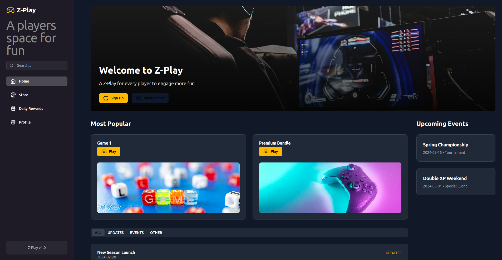
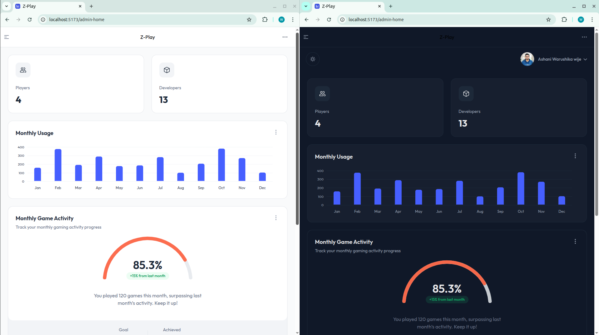
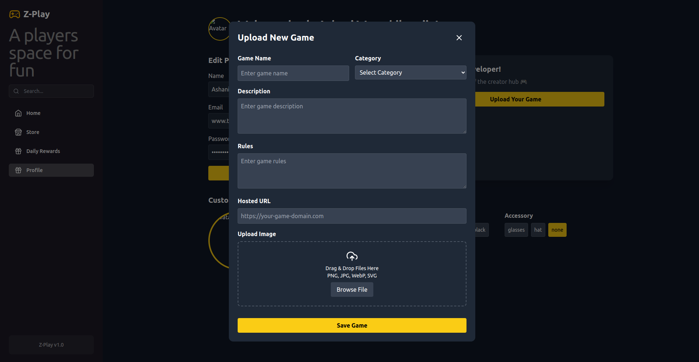

# 🎮 Z-Play Game Platform

Z-Play is a modern and interactive game platform that lets users browse, and claim daily rewards, while providing administrators with tools to upload and manage games. The platform features a **Spring Boot** backend and a **React** frontend, integrated with **Firebase** for authentication, **LiveKit** for real-time communication, and **DiceBear** for avatar generation.

---

## 🚀 Features

- 🕹️ Game Browsing
- 📥 Game Uploading and Management   
- 🎁 Daily Login Rewards  
- 🔐 Firebase Authentication  
- 🧸 Avatar Generation via DiceBear  
- 🎤 Chat with LiveKit  
- 📊 Interactive Admin Dashboard  

---

## 📸 Screenshots

### 🏠 Home Page  


### 📊 Admin Dashboard  


### ⬆️ Game Upload Form  


### 🎉 Daily Rewards  


---

## 🛠️ Tech Stack

### 🔙 Backend
- Java 17
- Spring Boot
- Maven
- MySQL

### 🔜 Frontend
- React
- Firebase (Auth & Firestore)
- DiceBear Avatars
- LiveKit (WebRTC)

---

## 🧰 Setup Instructions

### ✅ Prerequisites
- **Java 17+**
- **Node.js v16+**
- **Maven**
- **MySQL**
- **Firebase Project**
- **LiveKit Cloud or Self-hosted Server**

---

### 🔙 Backend Setup

1. **Clone the Repository**
   ```bash
   git clone https://github.com/Warushika-Wijayarathna/GameHubTemplate.git
   cd GameHubTemplate/backend
   ```

2. **Configure the Database**

   Open and update the following file:

   📄 `src/main/resources/application.properties`
   ```properties
   spring.datasource.url=jdbc:mysql://localhost:3306/zplay
   spring.datasource.username=your_username
   spring.datasource.password=your_password
   ```

3. **Build and Run**
   ```bash
   mvn clean install
   mvn spring-boot:run
   ```

---

### 🌐 Frontend Setup

1. **Navigate to the Frontend**
   ```bash
   cd ../frontend/GameHubTemplate
   ```

2. **Configure Firebase**

   - Create a project on [Firebase Console](https://console.firebase.google.com/)
   - Enable **Email/Password Authentication**
   - Set up **Cloud Firestore**
   - Get your Firebase config and replace in your project:
   
   📄 `src/firebase-config.js` or environment variables

   ```js
   const firebaseConfig = {
     apiKey: "your_api_key",
     authDomain: "your_project.firebaseapp.com",
     projectId: "your_project_id",
     storageBucket: "your_project.appspot.com",
     messagingSenderId: "your_sender_id",
     appId: "your_app_id"
   };
   ```

3. **Install Dependencies**
   ```bash
   npm install
   ```

4. **Run the Development Server**
   ```bash
   npm start
   ```

5. **Visit the App**
   Open your browser at: [http://localhost:3000](http://localhost:3000)

---

### 🎤 LiveKit Integration (Optional)

Enable real-time voice/video features with [LiveKit](https://livekit.io/):

1. Create an account on LiveKit or self-host your server.
2. Obtain API Key and Secret.
3. Add to environment variables or config.
4. Use `@livekit/components-react` to integrate WebRTC-based features.

---

### 🧸 DiceBear Avatars

Z-Play automatically assigns unique avatars to users using the DiceBear Avatars API.

```ts
const avatarUrl = `https://api.dicebear.com/7.x/bottts/svg?seed=${userId}`;
```

You can use this `avatarUrl` as the user’s profile picture across the app.

---

## 🎬 Demo Video

Watch the full platform in action:  
📽️ **[▶️ Z-Play Demo](#)** *(Insert your YouTube or drive video link here)*

---

## 👨‍💻 Developed By

**Warushika Wijayarathna**  
🔗 [GitHub Profile](https://github.com/Warushika-Wijayarathna)

---

## 📄 License

This project is licensed under the MIT License.  
See the [LICENSE](LICENSE) file for more details.
